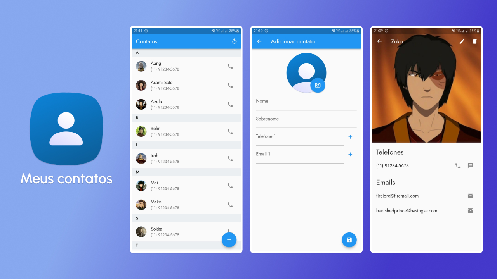

# Meus contatos

App de contatos desenvolvido em Dart e Flutter para um projeto da trilha de
aprendizado de Flutter oferecida pelo Santander através da plataforma [DIO](https://www.dio.me/sign-in).




## Funcionalidades

### Imagem de perfil

- O app permite a adição de imagem de perfil para que você possa identificar rapidamente seus contatos

### Múltiplos emails e telefones

- O app permite que você salve vários emails e telefones para cada contato

## Executando o projeto

Para executar o projeto você precisa ter o [Flutter](https://flutter.dev/)
instalado em sua máquina.

Esse passo a passo explica como executar o projeto via [VS Code](https://code.visualstudio.com/).

1. Abra a pasta do projeto no terminal

2. Execute o comando a seguir para instalar as dependências do projeto

   ```bash
   flutter pub get
   ```

3. Abra o projeto no VS Code e instale a [extensão Flutter](https://marketplace.visualstudio.com/items?itemName=Dart-Code.flutter)

4. Vá até o site [Bak4App](https://www.back4app.com/) e crie uma conta

5. Estando logado em sua conta, crie um novo app

6. Após a criação do app crie uma nova classe chamada `contato` e adicione os campos
conforme os tipos indicados a seguir:

   ```typescript
    telefones: array
    emails: array
    nome: string
    sobrenome: string
    imagem: string
   ```

7. Na tela de dashboard do seu app, navegue usando a barra lateral até a opção
`API` > `API Reference`

8. Na tela que abrirá navegue até a seção `Contato Class API`, em seguida role a
página até chegar na área intitulada `Creating Objects`

9. Role até encontrar a subseção `Headers`, em seguida copie o valor indicado em
`X-Parse-Application-Id` e o cole no primeiro campo do arquivo `.env`

10. Copie o valor indicado em `X-Parse-REST-API-Key` e cole no segundo campo do
arquivo `.env`

11. Abra o projeto flutter no VS Code e vá até a área inferior direita,
selecione o dispositivo em que você deseja executar a aplicação

12. Abra o arquivo `lib/main.dart` e aperte o botão play na área superior direita
